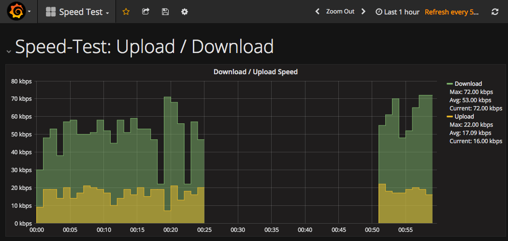

# 

> 

## About
Your ISP promises great bandwidth and reliability to you, but you don't fully trust?
Then _speedy_ is the solutio for you. Get more insights what you actually get for the money you pay.



## Table of Contents
<!-- toc -->

## Features

- Test the download & upload speed of your internet connection
- Save the results for historic analysis
- Ready to use dashboard to review the results


## Installation

### Prerequisites

- Docker (e.g. [Docker for Mac](https://docs.docker.com/docker-for-mac/) or [Docker for Windows](https://docs.docker.com/docker-for-windows/))

### Run it

Fork the repository:

```sh
$ git clone https://github.com/stefanwalther/speedy
```

Then run from the root directory:
```sh
$ docker-compose -d up
```

This will essentially spin up three Docker containers:

- **speedy** - Tiny node.js service to run a speed-test periodically (based on [speedtest-net](https://github.com/ddsol/speedtest.net).
- **InfluxDB** - Time series database to store the results from speedy, based on [InfluxDB](https://github.com/influxdata/influxdb).
- **Grafana** - Pre-Configured [Grafana](https://github.com/grafana/grafana) instance to visualize the results.

Access the resulting dashboard at:

- [http://localhost:3000/dashboard/db/speed-test](http://localhost:3000/dashboard/db/speed-test)

### Configuration

All configurations are stored in [`configuration.env`](./configuration.env).

- **speedy** 
    - See [here](./docker/speedy/) for more details
    - [Docker image](https://hub.docker.com/r/stefanwalther/speedy/)
- **speedy_infuxdb**
    - [Docker image](https://hub.docker.com/r/stefanwalther/speedy-influxdb/)
- **speedy_grafana**
    - [Docker image](https://hub.docker.com/r/stefanwalther/speedy-grafana/)


### Reference Links

- Environment variables for InfluxDB: https://docs.influxdata.com/influxdb/v1.2/administration/config#environment-variables

## Developing

Run the development environment:

```sh
$ yarn dc-dev-up
```

The development differs as follows from the example above:

- Containers are build on demand (from the Dockerfiles)
- You can work on the source code in `./docker/speedy/src` and the solution will automatically get updated (using [nodemon](https://nodemon.io/)).

## About

### Author


### Contributions

Contributions are always welcome. Just submit your PR.

### License


